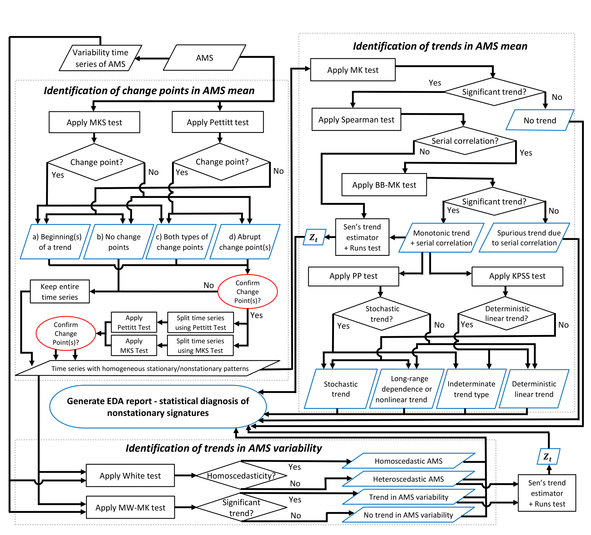

# EDA Framework

The exploratory data analysis (EDA) module of the flood frequency analysis (FFA) framework allows users to run statistical tests on annual maximum streamflow (AMS) data.
These statistical tests have four purposes:

1. Identify change points ("jumps" or "kinks") in the AMS data.
2. Identify [serial correlation](https://en.wikipedia.org/wiki/Autocorrelation) in the AMS data.
3. Identify trends in the mean value of the AMS data.
4. Identify trends in the variability of the AMS data.

A diagram showing the current EDA framework is shown below:

## List of Statistical Tests

### BB-MK Test

The **Block Bootstrap Mann-Kendall (BB-MK) Test** is used to assess whether there is a statistically significant monotonic trend in a time series.

Unlike the MK test, the BB-MK test is insensitive to autocorrelation.

- Null hypothesis: There is no monotonic trend.
- Alternative hypothesis: There is a monotonic upwards or downwards trend.

To carry out the BB-MK test, we rely on the results of the MK test and Spearman test.

1. Compute the MK test statistic.
2. Find the least significant lag $k$ using the Spearman test.
3. Resample from the original time series in blocks of size $k+1$, without replacement.
4. Estimate the MK test statistic for each bootstrapped sample.
5. Derive the empirical distribution of the MK test statistic from the bootstrapped statistics.
6. Estimate the significance of the observed test statistic using the empirical distribution.

The code used to implement this test can be found [here](https://github.com/rileywheadon/ffa-framework/tree/master/source/eda/bbmk).

### KPSS Test

The **KPSS Test** is used to identify if an autoregressive time series has a _unit root_.

- Null hypothesis: The time series has does not have a unit root.
- Alternative hypothesis: The time series has a unit root.

Precisely, the autoregressive time series shown below has unit root if $\sigma ^2 > 0$:

$$
\begin{align}
y_{t} &= \mu_{t} + \alpha t + \epsilon_{t} \\
\mu_{t} &= \mu_{t-1} + v_{t} \\
\end{align}
$$

Here's what each term in this formulation represents:

- $\mu_{t}$ is the _drift_, or the deviation of $y_{t}$ from $0$.
  - Under the null hypothesis, $\mu_{t}$ is constant (since $v_{t}$ is constant).
  - Under the alternative hypothesis, $\mu_t$ is a stochastic process with unit root.
- $\alpha t$ is a _linear trend_, which represents deterministic non-stationarity (i.e. climate change).
- $\epsilon_{t}$ is _stationary noise_, corresponding to reversible fluctuations in $y_{t}$.
  - In hydrology, $\epsilon_{t}$ represents fluctuations in streamflow due to random events (i.e. weather).
- $v_{t}$ is _random walk innovation_, or irreversible fluctuations in $\mu_{t}$.
  - In hydrology, $v_{t}$ could represent randomness in industrial activity causing climate change.

This test is implemented using R package [aTSA](https://cran.r-project.org/web/packages/aTSA/index.html) with the following settings:

- `lag.short = TRUE`, since AMS data has minimal autocorrelation.
- We consider `type3` results since we are assuming the presence of a trend.

For more information, see the [documentation](https://www.rdocumentation.org/packages/aTSA/versions/3.1.2.1/topics/kpss.test).

**Warning**: The implementation of the KPSS test in the aTSA package interpolates the p-value using a table from [Hobjin et al. (2004)](https://doi.org/10.1111/j.1467-9574.2004.00272.x).
This table only contains significance thresholds for $0.01$, $0.05$ and $0.10$.
Therefore, p-values below $0.01$ and above $0.10$ will be truncated.

The code used to implement this test can be found [here](https://github.com/rileywheadon/ffa-framework/tree/master/source/eda/kpss).

### Mann-Kendall Test

The **Mann-Kendall Test** is used to assess whether there is a statistically significant monotonic trend in a time series.
The test requires that when no trend is present, the data is independent and identically distributed.

- Null hypothesis: There is no monotonic trend.
- Alternative hypothesis: There is a monotonic upwards or downwards trend.

Define $\text{sign} (x)$ to be $1$ if $x > 0$, $0$ if $x = 0$, and $-1$ otherwise.

The test statistic $S$ is defined as follows:

$$
S = \sum_{k-1}^{n-1}  \sum_{j - k + 1}^{n} \text{sign} (y_{j} - y_{k})
$$

Next, we need to compute $\text{Var}(S)$, which depends on the number of tied groups in the data.
Let $g$ be the number of tied groups and $t_{p}$ be the number of observations in the $p$-th group.

$$\text{Var}(S) = \frac{1}{18} \left[n(n-1)(2n + 1) - \sum_{p-1}^{g} t_{p}(t_{p} - 1)(2t_{p} + 5) \right]$$

Then, compute the MK test statistic, $Z_{MK}$, as follows:

$$
Z_{MK} = \begin{cases}
\frac{S-1}{\sqrt{\text{Var}(S)}} &\text{if } S > 0 \\
0 &\text{if }  S = 0 \\
\frac{S+1}{\sqrt{\text{Var}(S)}} &\text{if } S < 0
\end{cases}
$$

For a two-sided test, we reject the null hypothesis if $|Z_{MK}| \geq Z_{1 - (\alpha/2) }$ and conclude that there is a statistically significant monotonic trend in the data. For more information, see [here](https://vsp.pnnl.gov/help/vsample/design_trend_mann_kendall.htm).

The code used to implement this test can be found [here](https://github.com/rileywheadon/ffa-framework/tree/master/source/eda/mk).

### Mann-Kendal-Sneyers Test

The **Mann-Kendall-Sneyers (MKS) Test** is used to identify the beginning of a trend in a time series:

- Null hypothesis: There are no change points in the time series.
- Alternative hypothesis: There are _one or more_ change points in the time series.

Define $\mathbb{I}(y_{i} > y_{j})$ to be $1$ if $y_{i} > y_{j}$ and $0$ otherwise.

Given a time series $y_{1}, \dots, y_{n}$, we compute the following test statistic:

$$
S_{t} = \sum_{i=i}^{t} \sum_{j=1}^{i-1} \mathbb{I}(y_{i} > y_{j})
$$

Then, we compute the the _progressive series_ $UF_{t}$:

$$
UF_{t} = \frac{S_{t} - \mathbb{E}[S_{t}]}{\sqrt{\text{Var}\,(S_{t})}}
$$

Next, we reverse the time series to create a new time series $y'$ such that $y_{i}' = y_{n+1-i}$.

Then, we use formula (1) to compute $S_{t}'$ for $y'$ and reverse $S_{t}'$ to get $S_{t}''$ .

The _regressive series_ $UB_{t}$ is defined as follows:

$$
UB_{t} = \frac{S_{t}'' - \mathbb{E}[S_{t}'']}{\sqrt{\text{Var}\,(S_{t}'')}}
$$

For both the progressive and regressive series, the expectation and variance is as follows:

$$
\mathbb{E}[S_{t}] = \mathbb{E}[S_{t}''] = \frac{t(t-1)}{4}, \quad
\text{Var}(S_{t}) = \text{Var}(S_{t}'') = \frac{t(t-1)(2t+5)}{72}
$$

Finally, we plot $UF_{t}$ and $UB_{t}$ with confidence bounds at $\pm z_{1 - (\alpha/2)}$, where $\alpha$ is the chosen significance level.
A crossing point between $UF_{t}$ and $UB_{t}$ that lies outside the confidence bounds indicates the start of the trend.

The code used to implement this test can be found [here](https://github.com/rileywheadon/ffa-framework/tree/master/source/eda/mks).

### MW-MK Test

The **Moving Window Mann-Kendall (MW-MK) Test** is used to identify a statistically significant monotonic trend in the variances of an AMS time series.

- Null hypothesis: There is no significant trend in the variance of the AMS.
- Alternative hypothesis: There is a significant trend in the variance of the AMS.

To compute the AMS variances we use a moving window:

1. Set the length of the moving window $w$ and the step size $s$.
2. Compute the standard deviation over indices $[1, w]$.
3. Move the window forward by $s$.
4. Check if the right boundary is beyond the end of the data. If not, go to (5).
5. Compute the standard deviation again. Return to (3).

Then, we perform the Mann-Kendall Test on the time series of variances.

For more information about the Mann-Kendall test, see [here](#mann-kendall-test).

The code used to implement this test can be found [here](https://github.com/rileywheadon/ffa-framework/tree/master/source/eda/mwmk).

### Pettitt Test

The **Pettitt Test** is used to identify abrupt changes in the mean of a time series.

- Null hypothesis: There are no abrupt changes in the time series mean.
- Alternative hypothesis: There is _one_ abrupt change in the time series mean.

Define $\text{sign}(x)$ to be $1$ if $x > 0$, $0$ if $x = 0$, and $-1$ otherwise.

Given a time series $y_{1}, \dots, y_{n}$, compute the following test statistic:

$$
U_{t} = \sum_{i=1}^{t} \sum_{j=t+1}^{n} \text{sign} (y_{j} - y_{i}), \quad K = \max_{t}|U_{t}|
$$

The value of $t$ such that $U_{t} = K$ is a _potential change point_. The p-value of the potential change point can be approximated using the following formula for a one-sided test:

$$
p \approx \exp \left(-\frac{6K^2}{n^3 + n^2}\right)
$$

If the p-value is less than the significance level $\alpha$, we reject the null hypothesis and conclude that there is evidence for an abrupt change in the mean at the potential change point.

The code used to implement this test can be found [here](https://github.com/rileywheadon/ffa-framework/tree/master/source/eda/pettitt).

### Phillips-Perron Test

The **Phillips-Perron (PP) Test** is used to identify if an autoregressive time series $y_t$ has a unit root.

- Null hypothesis: $y_{t}$ has a _unit root_ and is thus _non-stationary_.
- Alternative hypothesis: $y_{t}$ does not have a unit root and is _trend-stationary_.

Precisely, let $x_{t}$ be an [AR(1)](https://en.wikipedia.org/wiki/Autoregressive_model) model.
Let $y_{t}$ be a function of $x_{t}$ with drift $\mu$ and trend $\alpha t$.

$$
\begin{align}
y_{t} &= \mu + \alpha t + x_{t} \\
x_{t} &= \rho x_{t-1} + \epsilon_{t}
\end{align}
$$

- If $\rho = 1$, then $x_t$ and hence $y_t$ has a _unit root_ (null hypothesis).
- If $\rho < 1$, then $y_t$ is _trend stationary_ (alternative hypothesis).

This test is implemented using R package [aTSA](https://cran.r-project.org/web/packages/aTSA/index.html) with the following settings:

- `lag.short = TRUE`, since AMS data has minimal autocorrelation.
- We consider `type3` results since we are assuming the presence of drift and trend.

For more information, see the [documentation](https://www.rdocumentation.org/packages/aTSA/versions/3.1.2.1/topics/pp.test).

**Warning**: The implementation of the PP test in the aTSA package interpolates the p-value using a table from Fuller, W. A. (1996).
This table only contains significance thresholds for $0.01$, $0.05$ and $0.10$.
Therefore, p-values below $0.01$ and above $0.10$ will be truncated.

The code used to implement this test can be found [here](https://github.com/rileywheadon/ffa-framework/tree/master/source/eda/pp).

### Sen's Trend Estimator

**Sen's Trend Estimator** is used to estimate the slope of a regression line.
Unlike [Least Squares](https://en.wikipedia.org/wiki/Least_squares), Sen's trend estimator uses a non-parametric approach which makes it robust to outliers.

After computing the regression line using Sen's trend estimator, we use the **Runs Test** to determine whether the residuals from the regression are random.
If the Runs test identifies a non-random pattern in the residuals, it is a strong indication that the non-stationarity in the data is non-linear.

- Null hypothesis: The residuals are distributed randomly.
- Alternative hypothesis: The residuals _are not_ distributed randomly.

To compute Sen's trend estimator we use the following procedure:

1. Iterate over all pairs of data points $(x_{i}, y_{i})$ and $(x_{j}, y_{j})$.
2. If $x_{i} \neq  x_{j}$, compute the slope $(y_{j} - y_{i})/(x_{j} - x_{i})$ and add it to a list $S$.
3. Sen's trend estimator $\hat{m}$ is the median of $S$.

After computing $\hat{m}$, we can estimate the $y$-intercept $b$ by the median of $y_{i} - \hat{m}x_{i}$ for all $i$.

Prior to applying the Runs test, the data is categorized based on whether it is above or below the median. Then, we compute the number of contiguous blocks of $+$ or $-$ (or _runs_) in the data.

> **Example**: Suppose that after categorization, the sequence of data is as follows:
>
> $$
> +++--+++-+-
> $$
>
> This sequence has six runs with length $(3, 2, 3, 1,1, 1)$.

Let $R$ be the number of runs in $N$ data points (with category counts $N_{+}$ and $N_{-}$).

Then, $R$ is asymptotically normal with the following parameters:

$$
\mathbb{E}[R] = \frac{2N_{+}N_{-}}{N} + 1, \quad
\text{Var}(R) = \frac{2N_{+}N_{-}(2N_{+}N_{-} - N)}{N^2(N - 1)}
$$

For more information, see the [Wikipedia](https://en.wikipedia.org/wiki/Wald%E2%80%93Wolfowitz_runs_test) entry or the [R Documentation](https://search.r-project.org/CRAN/refmans/randtests/html/runs.test.html).

The code used to implement this test can be found [here](https://github.com/rileywheadon/ffa-framework/tree/master/source/eda/sens).

### Spearman Test

The **Spearman Test** is used to identify autocorrelation in a time series $y_{t}$.
A _significant lag_ is a number $i$ such that the correlation between $y_{t}$ and $y_{t-i}$ is statistically significant.
The _least insignificant lag_ is the largest $i$ such that all $j < i$ are significant lags.

- Null hypothesis: The least insignificant lag is $0$.
- Alternative hypothesis: The least insignificant lag is greater than $0$.

To carry out the Spearman test, we use the following procedure:

1. Compute Spearman's correlation coefficient $\rho_{i}$ for $y_{t}$ and $y_{t-i}$ for all $0 \leq  i <  n$.
2. Determine the $p$-value $p_{i}$ for each correlation coefficient $\rho _{i}$.
3. Iterate through $p_{i}$ to find the largest $i$ such that $p_{j} \leq  \alpha$ for all $j \leq i$.
4. The value of $i$ found in (3) is the least insignificant lag at confidence level $\alpha$.

**Remark**: To compute the $p$-value of a correlation coefficient $\rho _{i}$, first compute:

$$
t_{i}= \rho_{i} \sqrt{\frac{n-2}{1 - \rho _{i}^2}}
$$

Then, the test statistic $t_{i}$ has the $t$-distribution with $n-2$ degrees of freedom.

For more information, see the Wikipedia pages on [Autocorrelation](https://en.wikipedia.org/wiki/Autocorrelation) and [Spearman's Rho](https://en.wikipedia.org/wiki/Spearman%27s_rank_correlation_coefficient).

The code used to implement this test can be found [here](https://github.com/rileywheadon/ffa-framework/tree/master/source/eda/spearman).

### White Test

The **White Test** is used to detect changes in the variance of a time series.

- Null hypothesis: The variance of the time series is constant (homoskedasticity).
- Alternative hypothesis: The variance of the time series is time-dependent (heteroskedasticity).

Consider a simple linear regression model:

$$y_{i} = \beta_{0} + \beta_{1} x_{i} + \epsilon_{i}$$

Use ordinary least squares to fit the model. Then compute the squared residuals:

$${\hat{\epsilon}}_{i}^{2} = (y_{i} - \hat{y}_{i})^{2}$$

Next, fit an auxillary regression model to the squared residuals.
This model should include each regressor, the square of each regressor, and the cross products between all regressors.
Since $x$ is our only regressor,

$${\hat{\epsilon}}_{i}^{2} = \alpha_{0} + \alpha_{1}x_{i} + \alpha_{2}x_{i}^{2} + u_{i}$$

Next, we compute the [coefficient of determination](https://en.wikipedia.org/wiki/Coefficient_of_determination) $R^2$ for the auxillary model.
The test statistic is $nR^2 \sim \chi_{d}^2$, where $n$ is the number of observations and $d = 2$ is the number of regressors, excluding the intercept.
If $nR^2 > \chi_{1-\alpha }$, we reject the null hypothesis and conclude that the time series exhibits heteroskedasticity.

For more information, the following sources may be useful:

- [White Test Deep Dive](https://www.numberanalytics.com/blog/white-test-deep-dive)
- Marno Verbeek, A Guide to Modern Econometrics (2004)
- William H. Greene, Econometric Analysis, 5th Edition (2002)

The code used to implement this test can be found [here](https://github.com/rileywheadon/ffa-framework/tree/master/source/eda/white).
