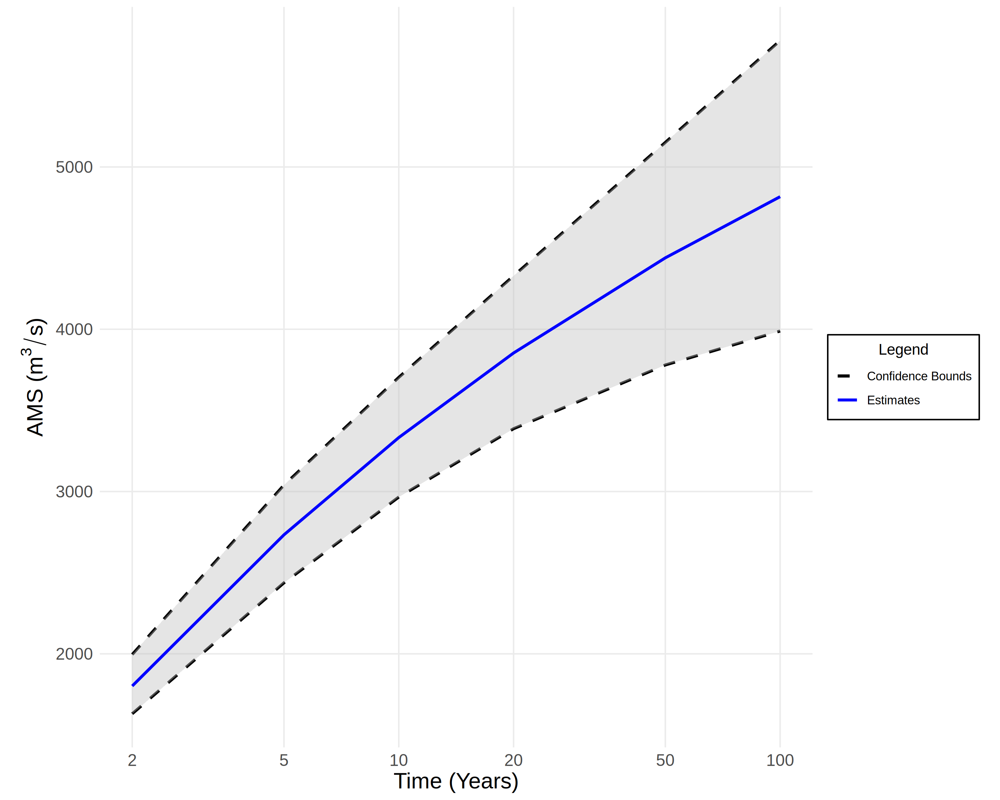

# Frequency Analysis

**Flood Frequency Analysis** (FFA) is the act of using a _fitted probability distribution_ to make predictions about the _frequency_ of extreme streamflow events (i.e. floods).
To do FFA, we require a [probability model](model-selection.md) with [suitably chosen parameters](parameter-estimation.md) based on the data.
This section will assume that these requirements are met.

Typically, we describe the severity of floods in terms of their _return period_.
Suppose we have a flood, which I will refer to as $A$.
If we expect to see a flood _at least as severe as_ $A$ every ten years, then we say that $A$ is a _ten-year flood_.
Since our framework uses _annual_ maximum streamflow data, a ten-year flood corresponds to an _exceedance probability_ of $0.1$.
Note that an exceedance probability of $0.1$ corresponds to the $1 - 0.1 = 0.90$ quantile of our probability distribution.
Here is a table of the return periods, exceedance probabilities, and quantiles used in the FFA framework:

| Return Period | Exceedance Probability | Quantile |
| ------------- | ---------------------- | -------- |
| $2$ Years     | $0.50$                 | $0.50$   |
| $5$ Years     | $0.20$                 | $0.80$   |
| $10$ Years    | $0.10$                 | $0.90$   |
| $20$ Years    | $0.05$                 | $0.95$   |
| $50$ Years    | $0.02$                 | $0.98$   |
| $100$ Years   | $0.01$                 | $0.99$   |

Suppose our fitted probability distribution has cumulative distribution function $F(x)$.
The function $F(x)$ maps annual maximum streamflow values to quantiles.
However, we want to determine the streamflow from the quantiles, so we use the inverse of the cumulative distribution $F^{-1}(x)$ instead.
The function $F^{-1}(x)$ is also known as the **Quantile Function**.

**Note**: The FFA framework uses the quantile functions implemented in the [lmom](https://cran.r-project.org/web/packages/lmom/lmom.pdf) package.

We typically present the results of a flood frequency analysis as a graph with time on the $x$-axis and annual maximum streamflow on the $y$-axis.
There are two ways to read a graph like this:

1. Estimate the severity of a flood for a given time period.
    From the graph below, we could determine that every 50 years, we can expect a streamflow event of approximately $4500\text{m}^3/\text{s}$.
2. Estimate the frequency of a flood for a given severity.
    From the graph below, we could determine that a streamflow event of $3000\text{m}^3/\text{s}$ or higher will occur every 6-7 years.

**Note**: For information about how the confidence bounds in this figure are computed, see [here](uncertainty-quantification.md).

## Handling Non-Stationarity

We say that a distribution is **Non-Stationary** if its mean or variance (or both) are changing over time.
Under non-stationarity, the quantile function of our fitted probability distribution is also a function of time $F^{-1}(x, t)$.

### An Idea for  Estimating Return Periods

Suppose we want to estimate the severity of a flood with return period $t_{0}$ at time $t^{*}$. 

1. Generate a sample $x_{1}, \dots, x_{t_{0}}$ where $x_{i} \sim \text{Unif} [0, 1]$. 
2. Compute simulated streamflow events $y_{1}, \dots, y_{t_{0}}$ where $y_{i} = F^{-1}(x_{i}, t^{*} + i)$. 
3. Let $z = \max (y_{1}, \dots, y_{t_{0}})$ be the most severe streamflow event in the sample.
4. Repeat steps 1-3 $n$ times to generate a sequence $(z_{1}, \dots, z_{n})$.
5. The mean $(z_{1}, \dots, z_{n}) / n$ is an accurate estimate of the severity.

