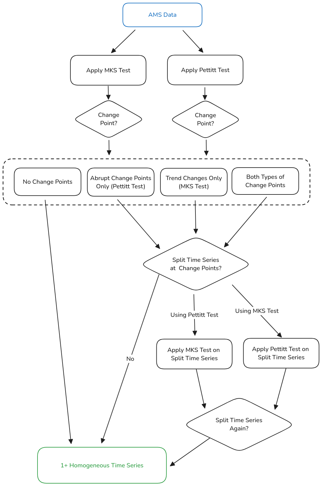
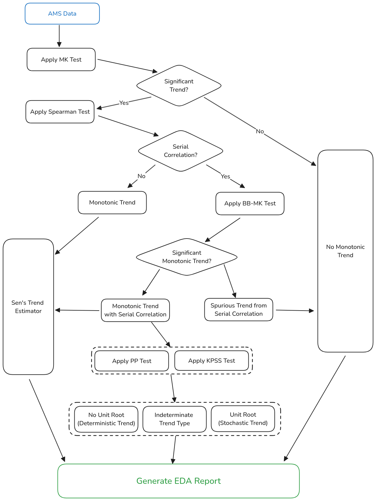

# EDA (Functional Specification)

## Overview

The exploratory data analysis (EDA) module of the flood frequency analysis (FFA) framework allows users to run statistical tests on annual maximum streamflow (AMS) data.
These statistical tests have four purposes:

1. Identify change points ("jumps" or "kinks") in the AMS data.
2. Identify [serial correlation](https://en.wikipedia.org/wiki/Autocorrelation) in the AMS data.
3. Identify trends in the mean value of the AMS data.
4. Identify trends in the variability of the AMS data.

## Scenarios

### Alice the Masters Student

Alice is a masters student taking ENCI 608: Sustainable Water Systems with Dr. Vidrio-Sahagún.
As part of the course, she must learn how to use the FFA framework.
Alice downloads the source code from GitHub and opens it with RStudio. 
Then, she ~~carefully reads the `README.md` file~~ immediately tries to run `eda.R`, receiving the following error[^1]:

> Error: file `data/ams.csv` does not exist. Please ensure that: 
> 1. You have placed a CSV file containing AMS data in `data`.
> 2. In `config.yml`, `csv_file` is set to the name of the CSV file.

Before reading the error message, she complains to Dr. Vidrio-Sahagún that his code does not work. 
Dr. Vidrio-Sahagún politely instructs her to read the error message and update `config.yml`, before giving the exact same instructions to the 30 other students in ENCI 608.

Once Alice downloads `Application_2.csv` and moves it into the `data` folder, she is finally able to run the script.
After a few seconds, she receives the following informational message:

> Preliminary change point analysis complete:
> - The Pettitt test has identified a change point in 1972.
> - The MKS test has identified change points in 1950, 1985.
>
> Please go to `reports/Application_2` and open `pettitt-test-all.png` and `mks-test-all.png` to inspect the results. Once you have done this, please select one of the following options:
>
> 1. Ignore the detected change points. 
> 2. Split the time series using the results of the Pettitt test (at 1972)
> 3. Split the time series using the results of the MKS test (at 1950, 1985)

Alice selects option (2). After waiting for a few more seconds, she receives another message:

> Change point analysis complete. Applying the MKS test to the split time series has identified no additional change points.
>
> You can view the results of the MKS test in `reports/Application_2`. The results for each time series are in `mks-test-1900-1972.png` and `mks-test-1973-2020.png`. 
>
> Press the ENTER key to continue.
 
Then, Alice presses the ENTER key and waits for a few seconds.

> Exploratory data analysis complete. You can find the report in `reports/Application_2/report.pdf`.

Alice opens the report and sees the results of each test, including p-values and test statistics.
The report also contains figures for the results of the Pettitt test, MKS test, BB-MK test, and Sen's trend estimator.

[^1]: It is also possible that `data_folder` and `report_folder` could be set incorrectly. If this happens, the user should receive similar error messages to the example above. 
 
### Bob the PhD Student

Bob is a second-year PhD student at the University of Calgary who is preparing for his candidacy exam.
One of his examiners is notorious for asking difficult questions about statistical tests for identifying trends in AMS data.
He getting frustrated while studying the Block-Bootstrap Mann-Kendall (BBMK) test until he remembers the FFA framework that his professor showed him in ENCI 608.
In order to better understand the BBMK test, he ~~carefully reads the `README.md`~~ tries random stuff until he discovers the following command:

```
Rscript run-stats.R -n bbmk -c config.yml --stats --math --code
```

Here's what each argument in his command does:

- `-n bbmk`: sets the name of the statistical test to `bbmk`
- `-c config.yml`: uses `config.yml` as the configuration file[^2]
- Bob does not use `-s`, since he does not wish to split the data
- `--stats` shows statistical information (p-values, test statistics, etc.)
- `--math` show the mathematical equations for computing the statistics
- `--code` shows the code used to carry out the test and generate the plot

[^2]: The `-c` argument defaults to `'config.yml'`, so Bob could have omitted this part.

After waiting for a few seconds, Bob receives the following output:

> BB-MK test complete. View the results in `report/Application_2/bbmk/report.pdf`.

Bob reads the report and learns how the BBMK test works.

In his candidacy exam, Bob is not asked about the BBMK test.

### Christine the Hydrologist

Christine works for HydroCorp as a hydrologist.
She has recently received 100 CSV files containing AMS streamflow data for different locations in Alberta.
Her task is to identify change points in each of the datasets and then estimate the trend within each time series.
Since her boss believes this is a very tedious task, she is given a whole week to complete it.

Christine is not looking forward to manually doing EDA on 100 datasets, so she asks her co-worker David if he knows a way to automate the process.
David tells her about the FFA framework, which has a `--batch` option for running EDA on many datasets.
She installs the framework and runs the following command:

```
Rscript eda.R -c config.yml --batch
```

A progress indicator appears on the screen.

> Running EDA on all 100 files in `data/`.
>
> 29/100

After a few minutes of waiting she receives the following information:

> EDA complete on all 100 files in `data/`.
>
> See `data/batch.json` for detailed information about the results.

Christine sends `batch.json` to her boss without looking at it.
Luckily, everything is right.

Christine is glad that she was able to automate this very tedious task.

She spends the rest of the week playing Candy Crush on her phone.

## Non-Goals

This version *will not* support the following features:

- Estimating future AMS data.
- Handling different time periods (i.e. monthly maximum streamflow data).
- Transforming data (i.e. removing serial correlation, removing trends).

## Flowchart

### Change Points



**Rationale**: Using change points from the MKS test and Pettitt test simultaneously may cause users to split the data too many times.
For example, change point analysis on `Application_2.csv` reveals three unique change points (1 from the Pettitt test and 2 from the MKS test).
However, there is only one clear change point.
Therefore, the user should split the data using the results of a *single* test and then apply the *other* test to check if there are any change points remaining.

### Identifying Trends in the Mean



**Rationale**: Consider a statistical time series model: $y_{t} = \rho y_{t-1} + \epsilon_{t}$.

- If $\rho = 0$, there is *no serial correlation*.
- If $\rho > 0$, there is *serial correlation*.
- If $\rho = 1$, there is a *unit root* (what the PP and KPSS tests look for).
- If $\rho > 1$, the time series is *explosive* (this is physically impossible).

Therefore all processes with a unit root will exhibit serial correlation. 
However, not all serially correlated time series will have a unit root.
If there is a significant trend and no serial correlation, *there is also no unit root*.
Therefore, if the Spearman test fails to reject, we don't need the PP/KPSS tests. 

If there is a significant trend *and* serial correlation, it is possible we have a unit root.
When performing the PP/KPSS tests we should use the drift + trend version (Type 3), *because we already identified a monotonic trend*.

R Documentation:

- https://www.rdocumentation.org/packages/aTSA/versions/3.1.2.1/topics/pp.test
- https://www.rdocumentation.org/packages/aTSA/versions/3.1.2.1/topics/kpss.test

We will use *short lag* since hydrological time series typically have minimal autocorrelation.
The current MATLAB version uses 0 lags, which is not recommended. See the "Tips" section of the MALTAB documentation:

- https://www.mathworks.com/help/econ/pptest.html
- https://www.mathworks.com/help/econ/kpsstest.html

### Identifying Trends in the AMS Variance

There are no modifications from the original framework.
